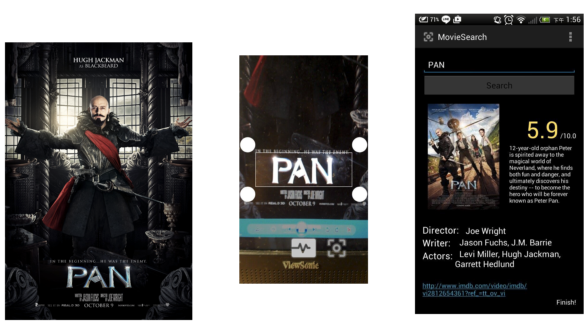
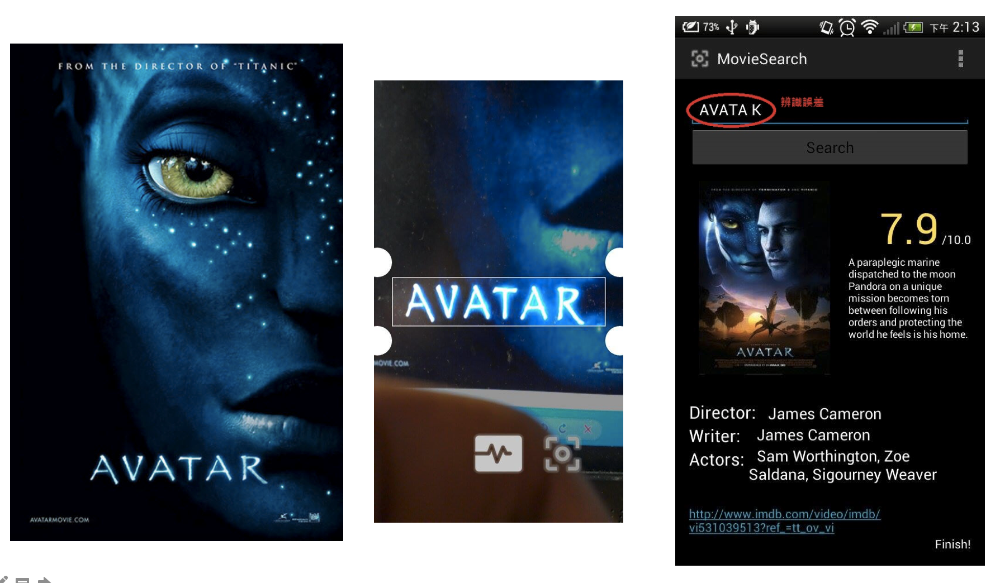

# Movie Poster Recognition
This is the project of lecture Software Creation Project in 2015 fall at NCTU. 

## Introduction
This adnroid application aims at recognize movie's title from common movie posters and retrieve related information including actors, director, introduction and rates. All of these movie information are obtained by parsing IMDB website.

## Demo
Demo 1: *PAN*

Demo 2: *AVATAR*

## Credit
[Tesseract (Open Source OCR Library)](https://github.com/tesseract-ocr/tesseract)
[Tess-Two](https://github.com/rmtheis/tess-two)
[jsoup: Java HTML Parser](http://jsoup.org)
[IMDb.com](http://www.imdb.com/?ref_=nv_home)
[Making a Simple OCR Android App using Tesseract](http://gaut.am/making-an-ocr-android-app-using-tesseract/#comment-184181)
[Android Character Recognition](http://www.codeproject.com/Articles/840623/Android-Character-Recognition)

## License
It is released under GNU GPL license. See the LICENSE file to see license rights and limitation.
